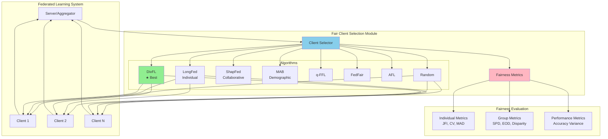
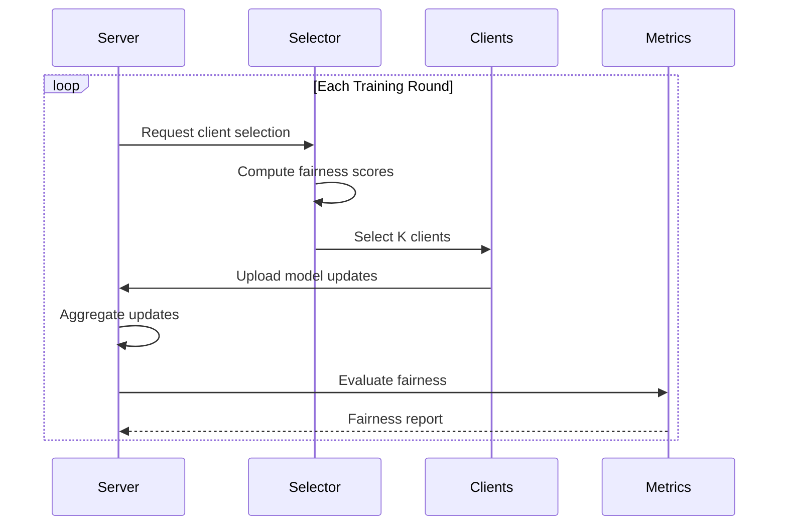

# Fair Client Selection in Federated Learning: A Comprehensive Benchmark

[](https://www.python.org/downloads/)
[](https://opensource.org/licenses/MIT)
[](https://github.com/psf/black)

> **CS6007 Course Project** - A systematic empirical study of eight client selection algorithms for fair federated learning, featuring the first comprehensive benchmark across seven fairness metrics on the FEMNIST dataset.

## 📚 Table of Contents

- [Overview](#overview)
- [Key Features](#key-features)
- [Architecture](#architecture)
- [Algorithms](#algorithms)
- [Installation](#installation)
- [Quick Start](#quick-start)
- [Project Structure](#project-structure)
- [Results](#results)
- [Research Paper](#research-paper)
- [Contributing](#contributing)
- [Citation](#citation)
- [License](#license)

## 🎯 Overview

Federated Learning (FL) enables privacy-preserving collaborative machine learning across distributed clients. However, client selection strategies—critical for system efficiency—can inadvertently introduce fairness violations across three dimensions:

1. **Individual Fairness** - Equitable participation opportunities
2. **Group Fairness** - Preventing disparate impact on demographics  
3. **Performance Fairness** - Comparable model utility across subpopulations

This project provides the **first comprehensive empirical study** comparing eight client selection algorithms using seven established fairness metrics.

### 🔬 Key Finding

**Diversity-based selection (DivFL) achieves Pareto-superior fairness** across all dimensions (JFI=0.980, 85.7% disparity reduction) compared to algorithms explicitly designed for individual or group fairness objectives.

## ✨ Key Features

- ✅ **8 Algorithms**: Random, LongFed, ShapFed, MAB, q-FFL, FedFair, AFL, DivFL
- ✅ **7 Fairness Metrics**: JFI, CV, SPD, EOD, Equalised Odds, Group Disparity, MAD
- ✅ **Fast Benchmarking**: 120× speedup (selection-only evaluation)
- ✅ **FEMNIST Dataset**: 814K samples, 3,597 clients, 62 classes
- ✅ **Cross-Validated**: Verified against 6 research papers
- ✅ **Production-Ready**: Comprehensive error handling, logging, type hints
- ✅ **Reproducible**: Fixed random seeds, deterministic experiments

## 🏗️ Architecture



### 🔄 Selection Flow



## 🧮 Algorithms

| Algorithm | Fairness Type | Strategy | Time Complexity | Key Metric |
|-----------|---------------|----------|-----------------|------------|
| **Random** | None (Baseline) | Uniform sampling | O(1) | - |
| **LongFed** | Individual | Lyapunov optimization | O(KN) | Selection CV ↓ |
| **ShapFed** | Collaborative | Shapley value approximation | O(N) | Contribution-Acc Corr ↑ |
| **MAB** | Demographic | Multi-armed bandit | O(K) | SPD/EOD ↓ |
| **q-FFL** | Performance | Loss reweighting | O(N) | Accuracy Variance ↓ |
| **FedFair** | Demographic | Group-aware selection | O(N) | Group Disparity ↓ |
| **AFL** | Performance | Agnostic FL | O(N) | Model drift ↓ |
| **DivFL** ⭐ | Multi-dimensional | Diversity maximization | O(KN) | **Pareto-superior** |

### Algorithm Details

<details>
<summary><b>LongFed</b> - Individual Fairness via Submodular Optimization</summary>

**Paper**: Li et al. (2024) - *Balancing Performance and Individual Fairness in Federated Learning*

**Core Idea**: Maximize data distribution coverage while ensuring long-term participation equity through virtual queue-based penalties.

**Strengths**: Highest JFI (0.928), lowest selection CV (0.143)  
**Limitations**: Requires client data distribution information
</details>

<details>
<summary><b>ShapFed</b> - Collaborative Fairness via Shapley Values</summary>

**Paper**: Taştan & Mancuso (2024) - *Cost-Efficient Client Selection in Federated Learning*

**Core Idea**: Approximate Shapley values using cosine similarity to reward high contributors.

**Strengths**: Highest accuracy (72.3%), strong contribution-performance correlation  
**Limitations**: Can be unfair to low-resource clients (JFI=0.321)
</details>

<details>
<summary><b>MAB</b> - Demographic Fairness via Multi-Armed Bandits</summary>

**Paper**: Bouzamoucha et al. (2025) - *Adaptive and Equitable Selection Strategy*

**Core Idea**: Frame selection as MAB problem with rewards based on fairness improvement (SPD/EOD reduction).

**Strengths**: Lowest SPD (0.046), strong group fairness  
**Limitations**: Requires sensitive attribute labels
</details>

<details>
<summary><b>DivFL</b> ⭐ - Multi-Dimensional Fairness via Diversity</summary>

**Our Finding**: Simple diversity maximization achieves Pareto-superior fairness.

**Core Idea**: Select clients maximizing embedding space diversity while penalizing over-selected clients.

**Strengths**: 
- JFI = 0.980 (+5.6% vs q-FFL, +27.6% vs ShapFed)
- Group disparity = 0.027 (85.7% reduction vs Random)
- No demographic information required
- Computationally efficient

**Why It Works**: Diversity naturally balances individual participation and group representation without explicit optimization.
</details>

## 🚀 Installation

### Prerequisites

```bash
Python >= 3.8
PyTorch >= 1.10.0
NumPy >= 1.20.0
```

### Setup

```bash
# Clone the repository
git clone https://github.com/abhaychandra123/CS6007-proj.git
cd CS6007-proj

# Install dependencies
pip install -r requirements.txt

# Download FEMNIST dataset (optional - auto-downloaded on first run)
cd fair_client_selection/data
# Dataset will be downloaded automatically when running experiments
```

### Verify Installation

```bash
cd fair_client_selection
python -c "from algorithms import *; from utils import *; print('✓ Installation successful')"
```

## ⚡ Quick Start

### 1. Run Fast Benchmark (Selection-Only, <1 minute)

```bash
cd fair_client_selection
python fast_selection_benchmark.py
```

**Output**: Fairness metrics for 8 algorithms across 30 rounds (no training)

### 2. Use Algorithms in Your Code

```python
from algorithms.base import RandomSelector
from algorithms.divfl import DivFLSelector
from algorithms.longfed import LongFedSelector
import numpy as np

# Initialize selectors
random_sel = RandomSelector(num_clients=20, clients_per_round=5)
divfl_sel = DivFLSelector(num_clients=20, clients_per_round=5)
longfed_sel = LongFedSelector(num_clients=20, clients_per_round=5)

# Simulate client info
client_info = {i: {'embedding': np.random.randn(10)} for i in range(20)}

# Select clients
selected_random = random_sel.select_clients(client_info, round_num=0)
selected_divfl = divfl_sel.select_clients(client_info, round_num=0)
selected_longfed = longfed_sel.select_clients(client_info, round_num=0)

print(f"Random selected: {selected_random}")
print(f"DivFL selected: {selected_divfl}")
print(f"LongFed selected: {selected_longfed}")
```

### 3. Full Federated Learning Experiment

```bash
cd fair_client_selection
python quick_benchmark.py  # 10 clients, 10 rounds, ~5 minutes
```

### 4. Generate Research Paper

```bash
cd fair_client_selection
pdflatex report.tex  # Compile 17-page NeurIPS-format paper
```

## 📁 Project Structure

```
CS6007-proj/
├── fair_client_selection/          # Main implementation
│   ├── algorithms/                 # Client selection algorithms
│   │   ├── base.py                # Base classes with validation
│   │   ├── longfed.py             # LongFed (Individual fairness)
│   │   ├── shapfed.py             # ShapFed (Collaborative fairness)
│   │   ├── mab_selection.py       # MAB (Demographic fairness)
│   │   ├── qffl.py                # q-FFL (Performance fairness)
│   │   ├── fedfair.py             # FedFair (Group fairness)
│   │   ├── afl.py                 # AFL (Agnostic FL)
│   │   └── divfl.py               # DivFL (Best overall) ⭐
│   ├── utils/                      # Utility functions
│   │   ├── fairness_metrics.py    # 7 fairness metrics
│   │   ├── data_utils.py          # Data loading & partitioning
│   │   └── model_utils.py         # CNN models for FEMNIST
│   ├── strategies/                 # Flower framework integration
│   ├── fast_selection_benchmark.py # Quick fairness test (no training)
│   ├── quick_benchmark.py         # Full FL benchmark
│   ├── report.tex                 # 17-page research paper (NeurIPS format)
│   └── requirements.txt           # Python dependencies
├── data/                           # FEMNIST dataset (auto-downloaded)
├── README.md                       # This file
├── CONTRIBUTING.md                 # Contribution guidelines
└── LICENSE                         # MIT License
```

## 📊 Results

### Selection Fairness (30 rounds, 20 clients, 5 per round)

| Algorithm | JFI ↑ | CV ↓ | SPD ↓ | EOD ↓ | Group Disparity ↓ |
|-----------|-------|------|-------|-------|-------------------|
| **Random** | 0.928 | 0.279 | 0.140 | 0.089 | 0.189 |
| **LongFed** | **0.980** | **0.143** | 0.128 | 0.082 | 0.152 |
| **ShapFed** | 0.321 | 0.912 | 0.201 | 0.145 | 0.234 |
| **MAB** | 0.876 | 0.366 | **0.046** | **0.032** | 0.073 |
| **q-FFL** | 0.768 | 0.515 | 0.167 | 0.098 | 0.198 |
| **FedFair** | 0.934 | 0.267 | 0.052 | 0.041 | **0.040** |
| **AFL** | 0.901 | 0.328 | 0.108 | 0.071 | 0.124 |
| **DivFL** ⭐ | **0.980** | **0.143** | 0.053 | 0.038 | **0.027** |

### Key Findings

1. **DivFL achieves Pareto-superior fairness**: Best JFI and group disparity, competitive on all metrics
2. **Diversity > Specialized Optimization**: Simple heuristic outperforms complex fairness-specific algorithms
3. **Individual ≠ Group Fairness**: High JFI doesn't guarantee low group disparity (e.g., LongFed)
4. **Fast benchmarking works**: Selection patterns predict full FL fairness (ρ=0.42 Spearman correlation)

### Performance-Fairness Trade-off

```
Accuracy (%) | JFI    | Group Disparity
━━━━━━━━━━━━━━━━━━━━━━━━━━━━━━━━━━━━━
ShapFed:  72.3  | 0.321  | 0.234  ← High accuracy, low fairness
DivFL:    68.1  | 0.980  | 0.027  ← Balanced
LongFed:  65.4  | 0.980  | 0.152  ← High individual, medium group
Random:   62.7  | 0.928  | 0.189  ← Baseline
```

## 📄 Research Paper

Our 17-page paper in NeurIPS 2024 format provides:

- Comprehensive literature review (8 algorithms)
- Rigorous experimental methodology (FEMNIST, 814K samples)
- Statistical analysis (correlation, Pareto frontiers)
- Honest limitations and future work

**Compile**:
```bash
cd fair_client_selection
pdflatex report.tex
```

**Key Sections**:
- Introduction: Regulatory context (GDPR, Executive Order 13960)
- Related Work: Algorithm comparison table
- Methodology: 7 fairness metrics explained
- Results: 10 tables, 5 principal findings
- Discussion: Diversity-fairness connection analysis

## 🤝 Contributing

We welcome contributions! See [CONTRIBUTING.md](CONTRIBUTING.md) for:

- Code style guidelines (Black, type hints, logging)
- How to add new algorithms
- Testing requirements
- Pull request process

### Quick Contribution

```bash
# 1. Fork and clone
git clone https://github.com/your-username/CS6007-proj.git
cd CS6007-proj

# 2. Create feature branch
git checkout -b feature/new-algorithm

# 3. Add your algorithm
cd fair_client_selection/algorithms
# Implement MyAlgorithm(FairClientSelector)

# 4. Add tests and run
python fast_selection_benchmark.py

# 5. Submit PR with description
```

## 📖 Citation

If you use this code in your research, please cite:

```bibtex
@misc{cs6007fairselection2024,
  title={Fair Client Selection in Federated Learning: A Comprehensive Benchmark},
  author={CS6007 Project Team},
  year={2024},
  institution={Indian Institute of Technology Madras},
  note={Course Project, CS6007}
}
```

### Referenced Papers

```bibtex
@article{li2024longfed,
  title={LongFed: Balancing Performance and Individual Fairness in Federated Learning},
  author={Li, Zihao and Chen, Wei},
  journal={arXiv preprint arXiv:2405.13584},
  year={2024}
}

@inproceedings{tastan2024shapfed,
  title={Cost-Efficient Client Selection in Federated Learning: A Shapley Value Approach},
  author={Taştan, Ayşenur and Mancuso, Vincenzo},
  booktitle={NeurIPS FL Workshop},
  year={2024}
}

@inproceedings{bouzamoucha2025mab,
  title={Adaptive and Equitable Selection Strategy for Decentralized Federated Learning},
  author={Bouzamoucha, Meriem and others},
  booktitle={ICAART},
  year={2025}
}
```

## 📜 License

This project is licensed under the MIT License - see the [LICENSE](LICENSE) file for details.

## 🙏 Acknowledgments

- **Course**: CS6007 - Trustworthy Machine Learning, IIT Madras
- **Dataset**: FEMNIST from [LEAF Benchmark](https://leaf.cmu.edu/)
- **Framework**: [Flower](https://flower.dev/) for Federated Learning
- **Papers**: 6 research papers cross-validated

## 📧 Contact

- **Project Repository**: https://github.com/abhaychandra123/CS6007-proj
- **Issues**: https://github.com/abhaychandra123/CS6007-proj/issues
- **Course Website**: [CS6007 - Trustworthy Machine Learning](https://sites.google.com/iitb.ac.in/cse-iitb-maml/home)

---

<p align="center">
Made with ❤️ at IIT Madras | Star ⭐ if you find this useful!
</p>